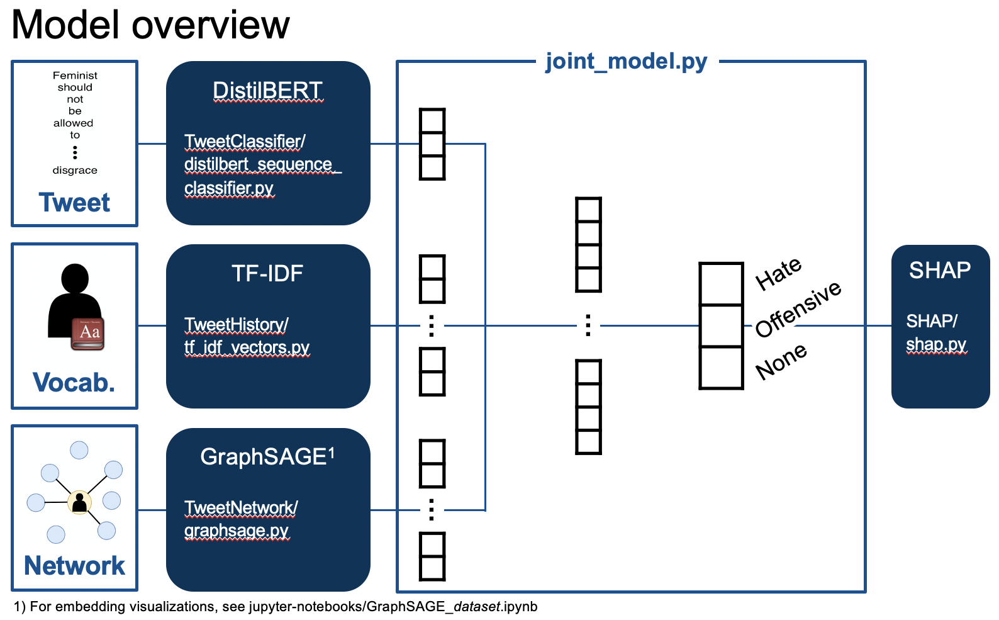

# About 

This repository is the code for the paper **"Explainable Abusive Language Classification Leveraging User and Network Data"** submitted to ECML/PKDD 21 (submission 663).

# Project Installation Instructions
Set up a conda environment using requirements.txt and following the additional installation-instructions.txt 

# Structure

The project root folder mainly divides itself into five parts:

* **Preprocessing**, containing a brief overview of some initial data adjustments necessary for the vocabulary, the network and the explainability of the network

* the individual model components, mainly **TweetClassifier**, **TweetHistory** and **TweetNetwork** containing the relevant models for each component

* the **joint\_model.py** file aggregating the individual components into one joint model

* the **SHAP** folder containing the explainability methods

* a folder containing several **jupyter notebooks**: one for each dataset to initialize model, data and training as well as results computations; one for each dataset to derive the GraphSAGE visualizations and an exemplary workbook to showcase the SHAP computations

* **utils** containing support methods required to run the model

* **dataset parser** for each dataset used to generate the training data, validation data and test data for the 

# Data

Due to Twitter's policy, we are not able to share the enriched datasets that contain the social network data in this repository. Feel free to contact us to get the data for Waseem and for Davidson dataset. To get Wich's dataset, contact the authors directly.

* Waseem, Z., & Hovy, D. (2016, June). Hateful symbols or hateful people? predictive features for hate speech detection on twitter. In Proceedings of the NAACL student research workshop (pp. 88-93).

* Davidson, T., Warmsley, D., Macy, M., & Weber, I. (2017, May). Automated hate speech detection and the problem of offensive language. In Proceedings of the International AAAI Conference on Web and Social Media (Vol. 11, No. 1).

* Wich, M., Breitinger, M., Strathern, W., Naimarevic, M., Groh, G., & Pfeffer, J. (2021). Are your Friends also Haters? Identification of Hater Networks on Social Media: Data Paper. In Companion Proceedings of the Web Conference 2021 (WWW'21 Companion)).

# Model Flow

An overview of the model flow is provided in the visualization below:

